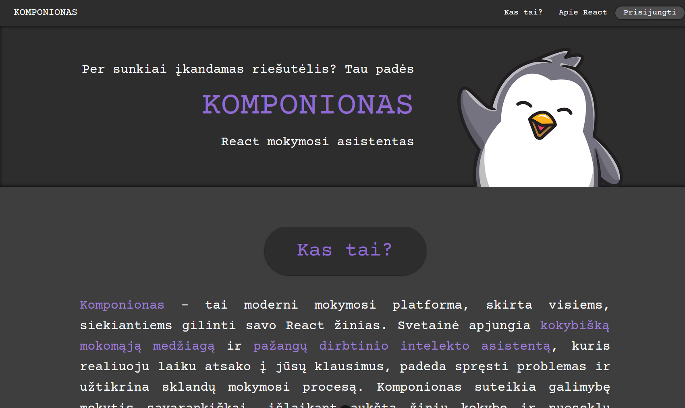
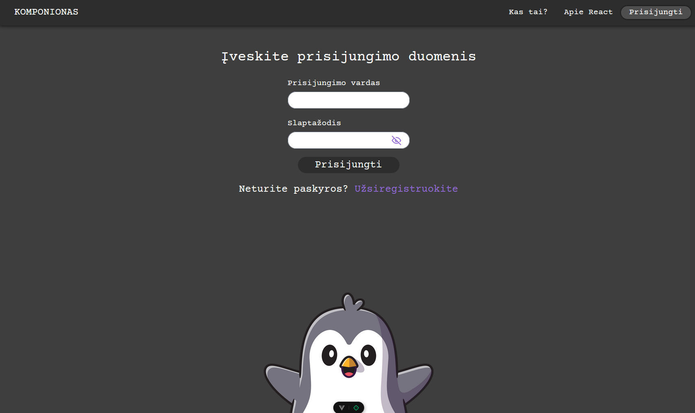
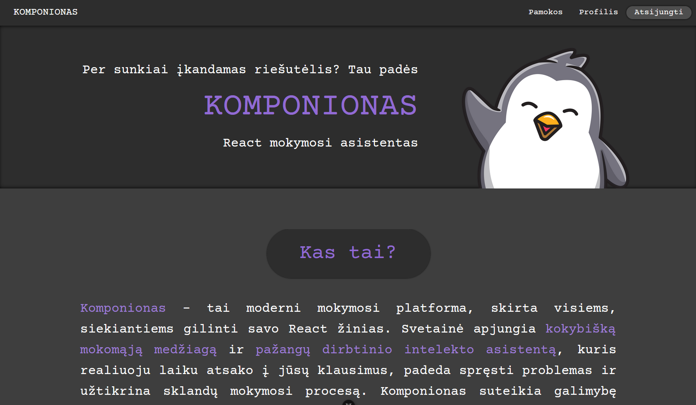
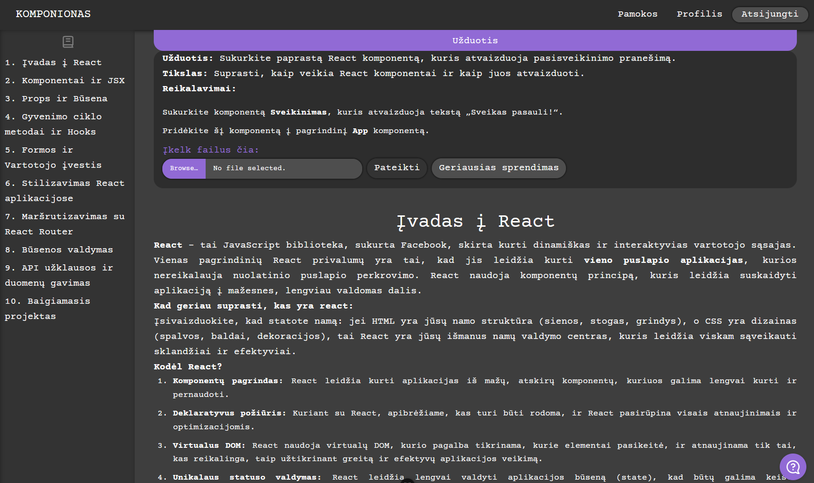
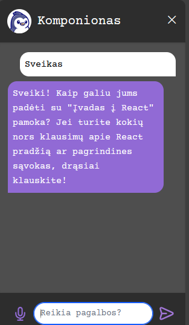

# Kompanionas

This is a concise frontend course covering React fundamentals. Each lecture includes tasks to reinforce learning, and an integrated ChatGPT-powered assistant provides real-time support.

## Images

### Main Dashboard

### Login Page

### Home Page

### Lesson Page

### Chat Window

